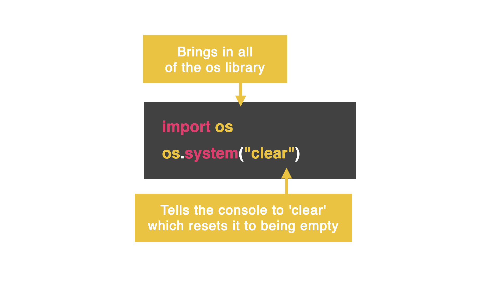

# os Library

**What is the os library?**

It allows us to "talk" to the console. One of the most powerful things we can do with this library is allow it to clear the console. 

## Import the os library

👉 Well, this just prints a list of numbers to 1,000...

```python
import os
for i in range(1,1000):
  print(i)
 ```

## Adding os.system

We can clear the code above by using the `os.system` function to 'clear' the console.



👉 Add this to the code above: (remember to indent this properly)

```python
os.system("clear")
```
Do you notice how it clears the console? Cool, right?!

## Let's try one more...
👉 For this code, I want the program to say "Welcome to Replit!", delete that, and then ask for my username on a blank screen. Remove the previous code, add the code below and see what happens when you hit `run`!

```python
import os
print("Welcome")
print("to")
print("Replit")

os.system("clear")

username = input("Username: ")
```
Wow! The console printed *and cleared* 'Welcome to Replit!' before I even had a chance to read it. 

### Let's fix that with another library.
