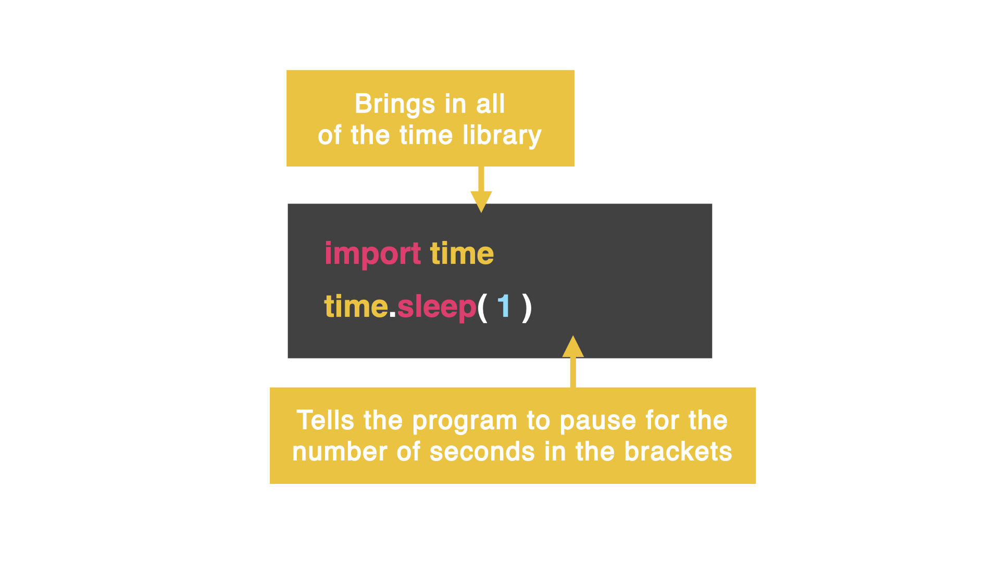

# Time Library

We can import a second library by placing a `,` after the name of the first library.

👉 Let's add a second library, time.

```python
import os, time
```

This library allows us to pause the execution of a program for a specific amount of time. 



The `time.sleep(1)` function allows us to pause the program for the amount of seconds listed in the `()`.

👉 Add this to your code *before* the program is cleared to pause the program for 1 second before displaying the username.

```python
time.sleep(1)
os.system("clear")
```
### Try it out with other amounts of time and see what happens.